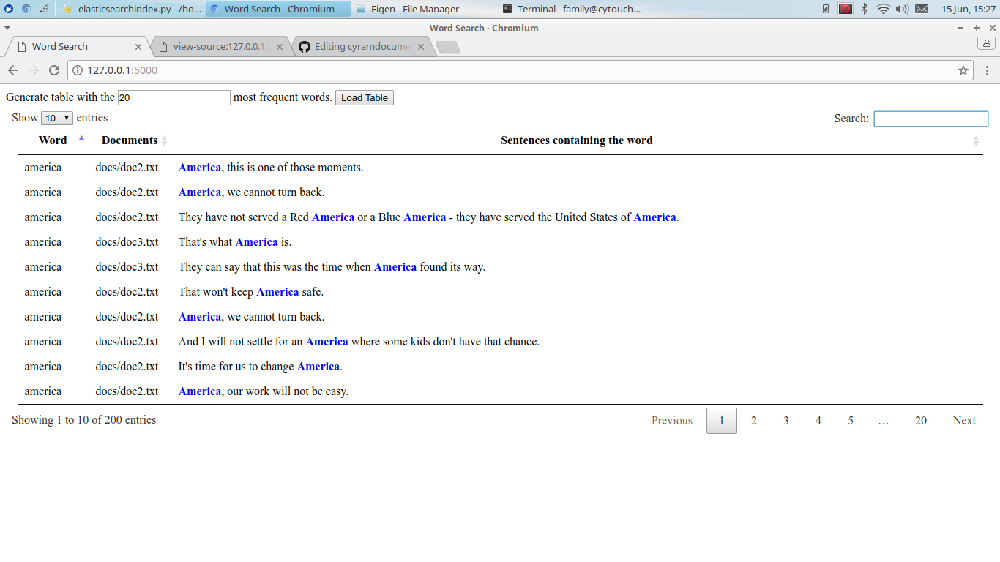

# cyramdocumentindex

## What is this?
This is a simple document indexer and searcher using Elasticsearch, Nltk, and Flask

* Elasticsearch - Indexing of the files
* Nltk - Determining what sentences are in the document, and possibly enabling things like pos_tag() to get parts of speech if needed
* Flask - Giving a very basic front-end to display the results

The front-end uses basic jQuery, and datatables.js with almost no styling.

## How to use
* Install python3
* Install elasticsearch & setup: ```sudo apt-get install elasticsearch```
* install needed python libraries:  ```pip install -r requirements.txt```
* Check this code out
* put all docs in the docs directory
* run elasticsearchindex.py to index all documents
* Once everything is indexed, run runapp.py to start flask
* point browser to 127.0.0.1:5000

You should see this:


## Where to go from here
This is a very basic setup, and would need further developing to be useful.  Some areas to consider:
* Elasticsearch should be able to do its own word frequency counting using its analysis engine, but I couldn't get this to work, so I defaulted to other word-counting means.  This would need to be fixed.
* Elasticsearch is very flexible, and indexing could be done across nodes.  I haven't done this before, but it would be an easy way to divide the load in indexing files
* NLTK could do more and start to determining things like parts of speech.  This could better refine results and how they're displayed and could even autosummarise to an extent what is being said about a given search term.
* Data such as how often words appear is being calculated, but isn't being displayed.  This could be added.
* Drop-down menus could be added to the datatables to allow for narrowing down which documents to look for.  A more complex solution would be to better structure the index so that different documents could be targeted by the search instead of an all-or-nothing search like is currently being done
